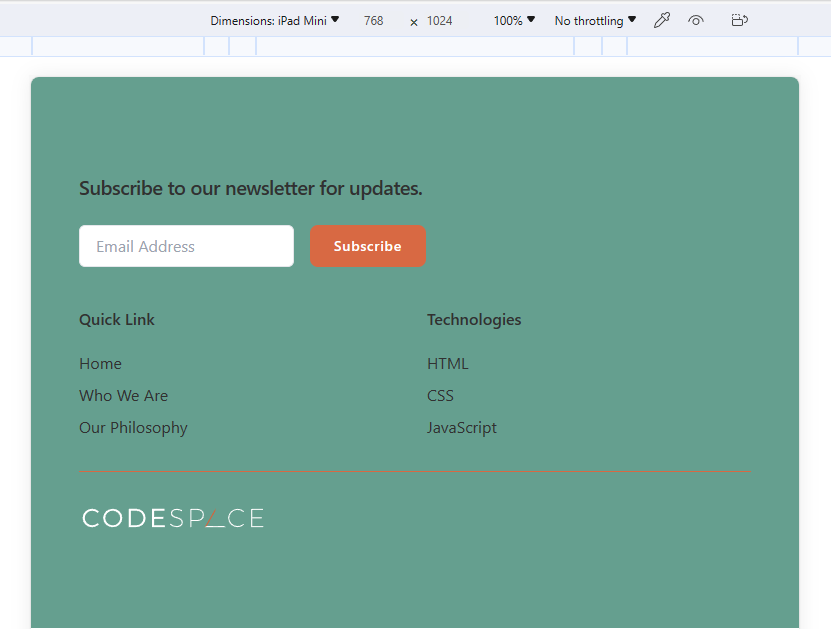

# 🌍 Responsive Layout Project


This is a solution to the CS Footer on [CodeSpace Academy](https://www.codespace.co.za/) as part of the Frontend Software Development Course.  
Frontend Mentor challenges help you improve your coding skills by building realistic projects.

---

## 📋 Table of contents

- [🌍 Responsive Layout Project](#-responsive-layout-project)
  - [📋 Table of contents](#-table-of-contents)
  - [Overview](#overview)
    - [The challenge](#the-challenge)
    - [Screenshots](#screenshots)
    - [Links](#links)
  - [My process](#my-process)
    - [Built with](#built-with)
    - [What I learned](#what-i-learned)

---

## Overview

### The challenge

Users should be able to:

- View the layout optimally on:
  - Desktop (1440px and up)
  - iPad Mini (768 × 1024)
  - iPhone SE (375 × 667)
- Experience a **responsive** layout that adjusts smoothly between devices
- See **hover and focus** states for all interactive elements

---

### Screenshots

**Desktop View**  


**Tablet View (iPad Mini 768x1024)**  


**Mobile View (iPhone SE 375x667)**  


---

### Links

- **Live Site URL:** [Add your live site URL here](https://your-live-site-url.com)

---

## My process

### Built with

- Semantic **HTML5** markup
- **CSS custom properties**
- **Flexbox** and **CSS Grid**
- **Media queries** for responsive breakpoints
- **Mobile-first workflow**

---

### What I learned

This project helped me strengthen my understanding of **responsive design** and **adaptive layouts**.  
I practiced using **relative units** like `rem`, `%`, and `vh/vw` for more fluid scaling.

```css
@media (max-width: 768px) {
  .container {
    grid-template-columns: 1fr;
    padding: 1.5rem;
  }
}
```
